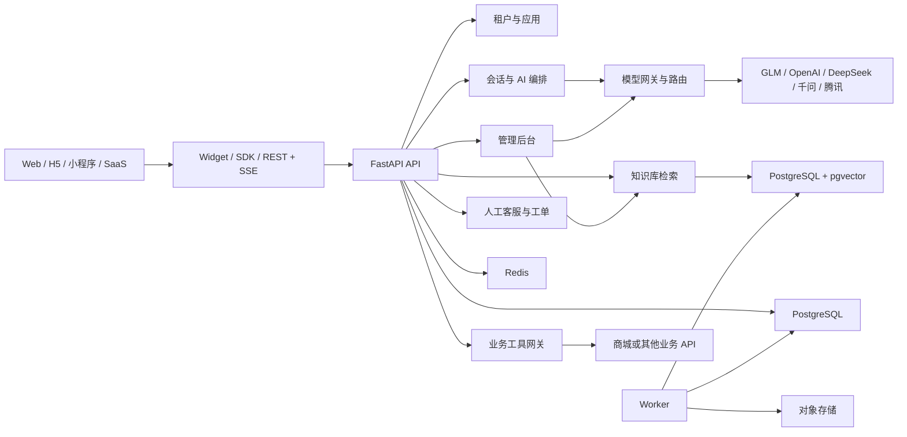

# AI 客服平台长期架构蓝图

> 本文保存产品成熟阶段的架构和能力边界，不作为当前版本排期使用。
> 当前开发必须遵循 [`AGENTS.md`](../AGENTS.md)，版本顺序和逐版验收见
> [`version-roadmap.md`](version-roadmap.md)，V1.0 唯一执行计划是
> [`v1-development-plan.md`](v1-development-plan.md)。本文中原有的 M0-M7
> 仅作为长期能力拆分参考；与当前版本计划冲突时，以当前版本计划为准。

## 1. 项目定位

项目暂定名为 `ai-customer-service`，定位是一个可以被商城、SaaS、内容站点和企业内部系统快速接入的 AI 客服平台，而不是只服务 `go-mall` 的聊天模块。

平台解决五个核心问题：

1. 用租户隔离的知识库回答业务问题，并返回可追溯来源。
2. 通过受控工具查询或操作接入方业务，而不是让模型直接访问数据库。
3. AI 无法处理、用户主动要求或涉及高风险操作时转交人工客服。
4. 通过稳定的公共 API、SDK 和 Widget 降低其他项目的接入成本。
5. 让平台管理员和租户管理员通过管理后台配置模型、知识库与应用绑定，不依赖修改服务端 YAML 和重新部署。

V1.0 只使用中立演示租户。博客在 V1.1 验证通用内容源，`go-mall` 在 V1.2 验证实时只读工具；两者都不是平台核心领域模型的一部分，认证、数据库和部署保持独立。

## 2. 成熟阶段成功标准

产品进入成熟阶段时应达到以下标准：

- 新项目按照接入文档，30 分钟内可以创建应用并完成基础对话接入。
- Web 项目只需加载 Widget 并获取短期用户令牌，不需要把平台 Secret 暴露给浏览器。
- 租户 A 无法读取、检索、调用或统计租户 B 的任何数据，并有自动化隔离测试。
- 每个租户可以创建多个自有知识库，管理自己的文档和检索策略，并将知识库绑定到一个或多个应用。
- 知识库回答必须返回文档和片段来源；没有可靠证据时明确告知并转人工。
- 商品、订单等业务数据只通过接入方注册的工具访问。
- 所有工具调用记录调用人、参数摘要、结果、耗时和状态。
- 写操作需要明确权限、幂等键和用户确认；高风险操作在没有独立版本设计与验收前只允许人工执行。
- 人工接管后 AI 停止自动回复，人工结束接管后才能恢复。
- 每次模型调用能够追踪租户、会话、模型、Token、耗时、费用估算和失败原因。
- 平台管理员可以在后台添加智谱、OpenAI、DeepSeek、千问或腾讯等供应商账号，测试后发布主备模型路由。
- 租户可以选择平台托管模型，或在权限允许时配置本租户自己的供应商 API Key。
- API 有 OpenAPI 文档、版本策略、统一错误格式和请求追踪 ID。

## 3. 早期阶段明确不做的内容

早期版本不实现：

- 微信、抖音、电话和邮件等全渠道聚合。
- 语音识别、语音合成和实时视频客服。
- 无人工确认的自动退款、自动取消订单等高风险写操作。
- 可视化 Agent 工作流编排器。
- 模型微调平台。
- 复杂计费和平台代理收款。
- 一开始拆分微服务。

这些能力可以在公共契约稳定、首个真实业务跑通后继续规划。

## 4. 核心设计原则

### 4.1 多租户不是后补字段

- 所有租户业务表从创建时就包含 `tenant_id`。
- 应用级数据同时包含 `application_id`。
- `tenant_id` 必须从认证凭据解析，不能相信客户端请求体传入的值。
- Repository 默认要求租户上下文，禁止没有租户条件的业务查询。
- 唯一约束一般包含 `tenant_id`，例如 `(tenant_id, external_user_id)`。
- 后台任务、缓存 Key、向量检索过滤条件和对象存储路径都必须包含租户边界。
- V1.0 使用应用层强制隔离；稳定后可增加 PostgreSQL Row Level Security 作为第二道防线。

### 4.2 AI 不直接连接业务数据库

AI 只能调用租户注册并授权的工具。例如商城提供：

```text
product.search
product.get
order.get
order.logistics.get
after_sale.status.get
support_ticket.create
```

工具由商城后端执行，商城仍然负责身份、数据权限和业务规则。客服平台只负责选择工具、签名调用、限制权限和保存审计记录。

### 4.3 契约先行

- 公共 API 统一位于 `/v1`。
- 先明确请求、响应、权限和错误契约，再实现业务逻辑。
- FastAPI/Pydantic 是 OpenAPI 单一事实来源，CI 导出快照供 Diff、文档和 SDK 使用。
- 请求使用标准 HTTP 状态码。
- 错误使用 `application/problem+json`，包含稳定的错误代码和 `request_id`。
- 创建类接口支持 `Idempotency-Key`。
- 废弃字段先标记并保留兼容周期，不直接删除。

### 4.4 模型能力可替换

业务 Service 不直接导入某家模型 SDK。对话模型、Embedding、Rerank、向量检索、对象存储和工具传输分别定义 Provider 接口，不能用一个接口假设所有供应商能力完全一致。

早期版本分别提供 Fake Chat/Embedding Provider 和 OpenAI-compatible Chat/Embedding Provider，具体模型根据可用性、成本和项目评估集选择，不在架构文档中绑定“永久免费”模型。成熟阶段再为有差异能力的供应商增加专用 Provider。每个模型部署显式声明流式输出、工具调用、结构化输出、Embedding、上下文长度等能力，并通过契约测试验证。

### 4.5 运行配置后台化

模型名称、供应商 Base URL、供应商 API Key、默认模型、备用模型、超时、Token 上限和租户预算属于运行时业务配置，必须通过管理后台维护并保存在数据库中。修改配置不要求重新部署服务。

配置按以下边界存放：

| 配置 | 存放位置 |
| --- | --- |
| PostgreSQL、Redis、日志和运行环境 | 环境变量或部署 YAML |
| 凭据根加密密钥 | 环境变量或云 KMS |
| 供应商类型和能力协议 | 代码 |
| 供应商账号与加密 API Key | 数据库，由后台管理 |
| 模型部署与主备路由 | 数据库，由后台管理 |
| 租户模型选择、BYOK 和预算 | 数据库，由租户后台管理 |
| 平台安全提示词 | 代码并版本化 |
| 租户品牌语气和转人工规则 | 数据库并版本化 |

供应商配置使用“草稿 -> 连通性测试 -> 能力测试 -> 发布 -> 回滚”的流程。API 进程按已发布版本加载配置，并通过 Redis 失效通知刷新短期缓存。未发布配置不能影响线上会话。

### 4.6 模块化单体优先

早期版本保持一个仓库、一个 API 服务和一个 Worker，通过领域模块隔离职责。不要为了“AI 平台”提前拆分微服务。文档解析和向量化等慢任务交给 Worker；关键状态先写数据库，再由可靠任务或 Outbox 驱动后续处理。

## 5. 用户与角色

| 角色 | 说明 |
| --- | --- |
| `platform_admin` | 管理平台租户、公共模型账号、模型目录和平台路由 |
| `tenant_owner` | 管理套餐、应用、管理员、租户知识库和 BYOK 权限 |
| `tenant_admin` | 管理本租户知识库、应用绑定、工具、客服人员和 AI 策略 |
| `agent` | 人工客服，处理分配给自己的会话和工单 |
| `analyst` | 只读查看会话质量、用量和报表 |
| `end_user` | 接入方的最终用户，例如商城顾客 |
| `service_account` | 接入方后端使用的机器身份 |

角色权限必须使用明确 Scope 表达，例如：

```text
knowledge:read
knowledge:write
knowledge:bind
model:read
model:manage
model:credential:rotate
conversation:read
conversation:reply
handoff:accept
tool:manage
analytics:read
```

## 6. 总体架构



### 6.1 进程职责

`api`：

- 认证、授权和租户解析。
- 会话创建与消息接收。
- SSE 流式响应。
- 模型配置、知识库、工具和客服后台 API。
- 已发布模型配置加载、租户路由和配置缓存失效。
- Webhook 接收与管理。

`worker`：

- 文档解析、清洗、分块和 Embedding。
- Webhook 投递和重试。
- 会话摘要和离线评估。
- 用量聚合与过期数据清理。
- Outbox 事件消费。

## 7. 技术栈

| 分类 | 长期默认选择 | 说明 |
| --- | --- | --- |
| 语言 | Python 3.12+ | 使用完整类型注解 |
| Web | FastAPI + Pydantic 2 | API、校验、OpenAPI、SSE |
| ORM | SQLAlchemy 2 Async | 异步数据库访问 |
| 迁移 | Alembic | 所有 Schema 变更版本化 |
| 主数据库 | PostgreSQL | 租户、会话、工单、审计和配置 |
| 向量检索 | pgvector | V1.0 降低基础设施复杂度 |
| 缓存 | Redis | 限流、短期状态、分布式锁和任务 Broker |
| 模型网关 | Provider 接口 + 路由策略 | 后台配置供应商、模型、主备路由和 BYOK |
| 后台任务 | Celery | Redis 作为 V1.0 Broker，不保留两套实现 |
| 对象存储 | S3 兼容接口 | 保存原始知识库文件 |
| HTTP 客户端 | HTTPX Async | 模型和业务工具调用 |
| 测试 | pytest | 单元、集成、契约和 E2E |
| 质量 | Ruff + mypy | 格式、Lint 和静态类型检查 |
| 可观测性 | OpenTelemetry + 结构化日志 | Trace、Metric 和 Log 关联 |
| 部署 | Docker Compose 起步 | API、Worker、PostgreSQL、Redis |

生产依赖必须锁定版本，并通过自动化依赖和漏洞检查更新，规划文档不固定未来容易过期的补丁版本。

## 8. 建议目录结构

```text
ai-customer-service/
├── app/
│   ├── main.py
│   ├── api/
│   │   └── v1/
│   ├── core/
│   │   ├── config.py
│   │   ├── security.py
│   │   ├── tenancy.py
│   │   └── observability.py
│   ├── domains/
│   │   ├── tenants/
│   │   ├── applications/
│   │   ├── identities/
│   │   ├── conversations/
│   │   ├── model_gateway/
│   │   ├── prompts/
│   │   ├── knowledge/
│   │   ├── tools/
│   │   ├── handoffs/
│   │   ├── webhooks/
│   │   └── usage/
│   ├── providers/
│   │   ├── llm/
│   │   ├── embeddings/
│   │   ├── vector_store/
│   │   ├── object_storage/
│   │   └── tool_transport/
│   ├── infrastructure/
│   │   ├── database/
│   │   ├── cache/
│   │   ├── queue/
│   │   └── outbox/
│   └── workers/
├── migrations/
├── openapi/
│   └── openapi.json
├── packages/
│   ├── admin-console/
│   ├── js-sdk/
│   └── widget/
├── tests/
│   ├── unit/
│   ├── integration/
│   ├── contract/
│   ├── isolation/
│   └── e2e/
├── docs/
├── scripts/
├── config.example.yaml
├── docker-compose.yml
├── pyproject.toml
└── README.md
```

每个领域模块内部再分为 `models`、`schemas`、`repository`、`service` 和 `router`。领域之间通过 Service 或事件交互，不跨模块直接操作对方的数据表。

## 9. 核心数据模型

### 9.1 租户与接入

| 模型 | 关键字段 |
| --- | --- |
| `Tenant` | `id`、`name`、`status`、`plan` |
| `Application` | `tenant_id`、`name`、`public_key`、`allowed_origins`、`status` |
| `ApiCredential` | `tenant_id`、`application_id`、`key_prefix`、`secret_hash`、`scopes`、`expires_at` |
| `WebhookEndpoint` | `tenant_id`、`url`、`secret_ciphertext`、`subscribed_events` |
| `WebhookDelivery` | `event_id`、`attempt`、`status`、`next_retry_at` |

Secret 只在创建时显示一次，数据库只保存不可逆 Hash；确实需要回调签名密钥时使用独立加密密钥加密保存。

### 9.2 身份与会话

| 模型 | 关键字段 |
| --- | --- |
| `EndUser` | `tenant_id`、`application_id`、`external_user_id`、`profile` |
| `AgentUser` | `tenant_id`、`email`、`password_hash`、`status` |
| `RoleAssignment` | `tenant_id`、`agent_id`、`role` |
| `Conversation` | `tenant_id`、`application_id`、`end_user_id`、`mode`、`status` |
| `Message` | `conversation_id`、`sender_type`、`content`、`status`、`model_info` |
| `Citation` | `message_id`、`document_id`、`chunk_id`、`quote`、`score` |
| `ConversationSummary` | `conversation_id`、`summary`、`covered_until_message_id` |

`Conversation.mode` 至少包含 `ai` 和 `human`。进入人工模式后，AI 编排器不得继续自动发送消息。

### 9.3 知识库

| 模型 | 关键字段 |
| --- | --- |
| `KnowledgeBase` | `tenant_id`、`name`、`description`、`retrieval_policy`、`status` |
| `KnowledgeBaseBinding` | `tenant_id`、`knowledge_base_id`、`application_id`、`priority`、`enabled` |
| `KnowledgeDocument` | `tenant_id`、`knowledge_base_id`、`source_type`、`version`、`status`、`checksum` |
| `KnowledgeChunk` | `tenant_id`、`document_id`、`content`、`metadata`、`embedding_model`、`embedding` |
| `IngestionJob` | `tenant_id`、`document_id`、`stage`、`status`、`error` |
| `KnowledgeUsage` | `tenant_id`、`document_count`、`storage_bytes`、`embedded_tokens` |

文档状态使用明确状态机，例如：

```text
uploaded -> parsing -> chunking -> embedding -> ready
                                      \-> failed
```

知识库是租户自有资源，不直接属于单个应用。一个租户可以创建多个知识库；一个知识库可以绑定多个应用；一个应用也可以组合多个知识库。`KnowledgeBaseBinding` 负责表达多对多关系，运行时必须同时校验租户归属和启用状态。

### 9.4 模型供应商与运行配置

| 模型 | 关键字段 |
| --- | --- |
| `AIProviderAccount` | `tenant_id`、`scope`、`provider_type`、`name`、`base_url`、`encrypted_api_key`、`region`、`status` |
| `AIModelDeployment` | `provider_account_id`、`model_id`、`purpose`、`capabilities`、`context_window`、`status` |
| `AIRoutingPolicy` | `tenant_id`、`application_id`、`purpose`、`primary_model_id`、`fallback_model_ids`、`limits` |
| `TenantAISetting` | `tenant_id`、`mode`、`daily_budget`、`allowed_models`、`status` |
| `AIConfigRevision` | `tenant_id`、`resource_type`、`resource_id`、`version`、`state`、`published_by` |
| `PromptVersion` | `tenant_id`、`application_id`、`type`、`content`、`version`、`state` |

`AIProviderAccount.scope` 支持：

```text
platform_managed  // 平台公共账号，租户按授权使用
tenant_byok       // 租户自带供应商 API Key
```

平台签发给接入方的 API Key 只保存 Hash；供应商 API Key 因调用模型时需要还原，必须使用服务器环境变量或 KMS 中的根密钥加密保存。后台只显示脱敏前缀和后缀，只支持替换、轮换和吊销，不支持再次查看完整密钥。

### 9.5 工具与人工接管

| 模型 | 关键字段 |
| --- | --- |
| `ToolDefinition` | `tenant_id`、`name`、`description`、`input_schema`、`risk_level` |
| `ToolBinding` | `application_id`、`tool_id`、`endpoint`、`auth_config`、`enabled` |
| `ToolInvocation` | `conversation_id`、`tool_id`、`arguments`、`status`、`result_summary` |
| `HandoffRequest` | `conversation_id`、`reason`、`priority`、`status`、`assigned_agent_id` |
| `SupportTicket` | `tenant_id`、`conversation_id`、`external_ticket_id`、`status` |
| `AuditLog` | `tenant_id`、`actor`、`action`、`resource`、`result`、`request_id` |

## 10. 公共 API 规划

### 10.1 平台与租户管理面

```http
POST   /v1/tenants
GET    /v1/tenants/current
POST   /v1/applications
GET    /v1/applications
PATCH  /v1/applications/{application_id}
POST   /v1/applications/{application_id}/credentials
DELETE /v1/applications/{application_id}/credentials/{credential_id}
```

### 10.2 最终用户运行面

```http
POST /v1/customer-tokens
POST /v1/chat/sessions
GET  /v1/chat/sessions/{session_id}
GET  /v1/chat/sessions/{session_id}/messages
POST /v1/chat/sessions/{session_id}/messages
POST /v1/chat/sessions/{session_id}/handoff
```

发送消息接口默认使用 SSE 返回以下事件：

```text
message.started
message.delta
citation.added
tool.started
tool.completed
handoff.requested
message.completed
error
```

需要非流式调用时通过明确参数或独立 Endpoint 支持，不能让 SDK 猜测响应类型。

### 10.3 知识库管理面

```http
POST   /v1/knowledge-bases
GET    /v1/knowledge-bases
GET    /v1/knowledge-bases/{id}
PATCH  /v1/knowledge-bases/{id}
DELETE /v1/knowledge-bases/{id}
POST   /v1/knowledge-bases/{id}/documents
GET    /v1/knowledge-bases/{id}/documents
GET    /v1/knowledge-bases/{id}/documents/{document_id}
DELETE /v1/knowledge-bases/{id}/documents/{document_id}
POST   /v1/knowledge-bases/{id}/bindings
DELETE /v1/knowledge-bases/{id}/bindings/{application_id}
GET    /v1/applications/{application_id}/knowledge-bases
POST   /v1/knowledge-bases/{id}/search
```

租户管理员只能管理当前租户的知识库、文档和应用绑定。平台提供的知识模板在租户选择后复制为租户资源，不让多个租户直接共享一组可修改文档。`search` 主要用于调试和验收检索结果，普通最终用户不直接调用。

### 10.4 模型与路由管理面

```http
POST   /v1/admin/ai/provider-accounts
GET    /v1/admin/ai/provider-accounts
PATCH  /v1/admin/ai/provider-accounts/{id}
POST   /v1/admin/ai/provider-accounts/{id}/test
POST   /v1/admin/ai/provider-accounts/{id}/rotate-key
POST   /v1/admin/ai/model-deployments
GET    /v1/admin/ai/model-deployments
POST   /v1/admin/ai/model-deployments/{id}/test
PUT    /v1/admin/ai/routing-policies/{purpose}
GET    /v1/admin/ai/routing-policies
GET    /v1/admin/ai/config-revisions
POST   /v1/admin/ai/config-revisions/{id}/publish
POST   /v1/admin/ai/config-revisions/{id}/rollback
```

平台管理员可以管理 `platform_managed` 账号；租户管理员只能在获得 BYOK 权限后管理本租户账号和本租户路由。所有读取接口均不返回完整供应商 API Key，自定义 Base URL 必须经过 HTTPS、DNS、内网地址和重定向安全检查。

### 10.5 工具管理面

```http
POST   /v1/tools
GET    /v1/tools
PATCH  /v1/tools/{tool_id}
POST   /v1/tools/{tool_id}/test
GET    /v1/tool-invocations
GET    /v1/tool-invocations/{invocation_id}
```

### 10.6 人工客服面

```http
GET  /v1/agent/queues
GET  /v1/agent/conversations
POST /v1/agent/handoffs/{handoff_id}/accept
POST /v1/agent/conversations/{conversation_id}/messages
POST /v1/agent/conversations/{conversation_id}/close
POST /v1/agent/conversations/{conversation_id}/resume-ai
```

### 10.7 Webhook 事件

成熟阶段至少支持：

```text
conversation.created
message.completed
handoff.requested
handoff.accepted
handoff.closed
tool.completed
knowledge.document.ready
knowledge.document.failed
```

Webhook 使用 HMAC 签名，签名内容包含时间戳、事件 ID 和原始 Body。接收方可以根据事件 ID 幂等处理；平台使用指数退避重试并保存每次投递结果。

## 11. 快速接入设计

### 11.1 JavaScript Widget

目标接入方式：

```html
<script
  src="https://cdn.example.com/ai-support-widget.js"
  data-application-id="app_xxx">
</script>
```

`application_id` 是公开标识，不具有服务端权限。登录用户的推荐流程：

```text
业务前端 -> 业务后端：申请客服 Token
业务后端 -> 客服平台：使用 Secret 创建 customer_token
客服平台 -> 业务后端：返回短期 JWT
业务后端 -> 业务前端：返回短期 JWT
业务前端 -> Widget：初始化 JWT
```

JWT 至少包含：

```text
tenant_id
application_id
external_user_id
scopes
exp
jti
```

浏览器永远不能获得租户 Secret。匿名访客使用受限匿名会话令牌，并配置来源域名和速率限制。

### 11.2 REST/SSE 和 SDK

- OpenAPI 是所有 SDK 的契约来源。
- V1.0 提供 JavaScript SDK；随后根据接入需求增加 Python 和 Go SDK。
- SDK 只封装认证、重试、流式事件和错误类型，不隐藏 HTTP 语义。
- 每个 SDK 必须有契约测试，确保与当前 OpenAPI 一致。

### 11.3 业务工具接入

接入方注册工具清单，例如：

```json
{
  "name": "order.get",
  "description": "查询当前登录用户的一张订单",
  "risk_level": "read",
  "input_schema": {
    "type": "object",
    "properties": {
      "order_no": {"type": "string"}
    },
    "required": ["order_no"],
    "additionalProperties": false
  }
}
```

工具调用请求必须带短期签名身份，接入方仍要校验 `external_user_id` 是否有权访问目标数据，不能只相信模型给出的订单号。

工具风险分级：

| 级别 | 示例 | 初始策略 |
| --- | --- | --- |
| `read` | 商品搜索、本人订单查询 | 授权后可自动调用 |
| `write` | 创建售后工单 | 用户确认后调用，必须幂等 |
| `sensitive` | 取消订单、退款、修改地址 | 默认转人工，不自动调用 |

V1.2 先采用 Signed HTTP 工具传输协议，V1.3 再增加 OpenAPI 和 MCP 适配。MCP 可以作为兼容层，但不能成为普通 Web 项目接入客服的唯一方式。

## 12. 知识库与 RAG 流程

### 12.1 租户知识库管理

- 租户所有者和租户管理员可以创建、修改、停用和删除本租户知识库。
- 每个租户可以拥有多个知识库，例如“商品说明”“售后政策”“内部客服手册”。
- 知识库通过 Binding 绑定到应用，同一知识库可以供该租户的 PC、H5 和小程序应用共同使用。
- 租户可配置安全范围内的召回数量、阈值、是否 Rerank 和无答案策略；平台设置上下限，防止失控配置。
- 每个租户独立统计文档数、存储量、Embedding Token 和检索次数，并按套餐执行配额。
- 平台管理员默认只能进行运维级审计，不能在普通管理流程中浏览租户文档正文。
- 删除租户时先停用检索，再异步清理对象文件、Chunk、向量和缓存，并保留审计记录。

### 12.2 入库流程

```text
上传文件或提交 URL
  -> 病毒与类型检查
  -> 保存原文件
  -> 提取文本
  -> 规范化和去重
  -> 按文档结构分块
  -> 生成 Embedding
  -> 写入向量索引
  -> 标记 ready
```

每个分块保留：租户、知识库、文档版本、标题、章节、来源 URL、Embedding 模型和权限标签。应用范围通过 `KnowledgeBaseBinding` 解析。删除或更新文档时必须同步失效旧向量，不能只修改文档主表。

### 12.3 检索与回答

推荐基础流程：

1. 根据租户、应用和知识库权限过滤候选数据。
2. 分别进行向量召回和关键词召回。
3. 使用 RRF 或等价策略融合、去重并结合元数据过滤。
4. 将少量高相关片段交给模型。
5. 要求模型只根据证据回答并引用片段。
6. 证据不足、冲突或分数过低时拒绝回答并建议转人工。

Reranker 和查询改写只有在固定评估集证明收益后增加，不能为了“高级 RAG”堆叠组件。

### 12.4 安全要求

- 把检索到的文档视为不可信输入，防止文档中的提示注入改变系统规则。
- 文档内容不得覆盖租户策略、工具权限或系统提示词。
- 上传文件限制类型、大小、页数和解压后体积。
- 敏感信息在进入模型前按策略脱敏。
- 配置数据保留与删除周期，支持删除用户会话和知识文档。

## 13. AI 编排流程

### 13.1 模型配置加载

API 只读取数据库中已发布的模型配置。配置优先级为：

```text
应用路由策略
  -> 租户路由策略
  -> 平台默认路由策略
```

每个用途分别选择模型，例如 `chat`、`embedding`、`rerank` 和 `summary`，不能默认由同一个模型完成全部工作。免费 GLM 可以作为默认对话模型，本地 `bge-m3` 可以作为默认 Embedding；租户也可以在权限和配额范围内切换到自己的供应商账号。

供应商配置缓存在进程内或 Redis 中，但数据库已发布版本是唯一事实来源。发布或回滚时发送缓存失效事件。只有超时、限流和供应商 5xx 等可重试错误才允许切换备用模型；已经向用户输出首个 Token 后不做无感模型切换。

### 13.2 请求编排

```text
接收用户消息
  -> 认证、租户解析、限流
  -> 会话状态与人工接管检查
  -> 意图和风险判断
  -> 检索知识或选择工具
  -> 工具授权与必要的用户确认
  -> 调用模型生成回答
  -> 内容检查和引用校验
  -> 流式输出
  -> 保存消息、用量、审计和评估数据
```

必须配置以下限制：

- 单次请求最大输入长度。
- 单会话最大工具调用步数。
- 模型和工具总超时。
- 单租户并发、Token 和费用预算。
- 工具参数 JSON Schema 校验。
- 模型失败时的降级和转人工策略。

不要保存或向用户展示模型内部推理过程。只保存业务所需的工具选择、结构化结果、引用和审计信息。

## 14. 人工客服接管

### 14.1 触发条件

- 用户明确要求人工客服。
- 连续多次没有可靠知识库证据。
- 模型或工具连续失败。
- 命中退款、投诉、隐私或高风险操作策略。
- 管理员配置的关键词或 VIP 规则。

### 14.2 接管流程

```text
创建 HandoffRequest
  -> AI 生成可验证的会话摘要
  -> 进入租户客服队列
  -> 客服接受
  -> Conversation.mode = human
  -> 人工回复
  -> 关闭会话或显式恢复 AI
```

摘要包含用户诉求、已确认事实、相关订单号、已调用工具和失败原因，但不能把模型猜测当成事实。接管、转派、回复、关闭和恢复 AI 都写入审计日志。

## 15. 安全与合规基线

- 平台签发的 API Key 只保存 Hash，日志只显示前缀。
- 模型供应商 API Key 使用根密钥或 KMS 加密保存，解密只发生在模型调用进程内。
- JWT 短期有效，包含 `aud`、`iss`、`exp`、`jti` 和 Scope。
- 管理后台和工具服务使用不同凭据与权限。
- 所有资源访问同时校验租户、应用和资源归属。
- Tool/Webhook URL 防止 SSRF：限制协议、解析后 IP、重定向和内网地址。
- 自定义模型 Base URL 使用与 Tool/Webhook 相同的 SSRF 防护，不允许租户访问内网元数据地址。
- Webhook 和工具请求包含时间戳、Nonce 和签名，防止重放。
- 日志不得记录完整 Token、密码、模型密钥和用户敏感字段。
- 删除租户时采用可审计的停用、导出、延迟清理流程。
- 写工具必须支持幂等；在写工具获得独立版本设计和验收前，资金类操作禁止 AI 自动执行。
- 所有管理操作、工具调用和人工接管均写不可随意修改的审计记录。

## 16. 可观测性与质量评估

### 16.1 运行指标

- 请求量、错误率和 P50/P95/P99 延迟。
- 首 Token 时间和完整回答时间。
- 模型调用成功率、Token、费用估算和限流次数。
- 检索耗时、召回数量和无证据回答比例。
- 工具调用成功率、超时率和重试次数。
- 人工转接率、等待时间、首次响应时间和解决时间。
- Worker 队列长度、任务失败率和 Webhook 积压。

### 16.2 AI 评估集

从 V1.0 开始维护版本化测试集。V1.0 至少覆盖：

- 能从知识库正确回答的问题。
- 知识库没有答案、必须拒答的问题。
- 文档之间存在冲突的问题。
- 必须转人工的退款和投诉问题。
- 提示注入和越权请求。

V1.2 再增加应调用商品或订单工具、无权查询其他用户订单、签名错误和重放请求等工具评估用例。

每次修改 Prompt、检索策略或模型前后运行同一评估集，比较回答正确性、引用正确性、工具选择、拒答和成本，而不是只凭人工体验判断。

## 17. 测试策略

| 测试层级 | 覆盖内容 |
| --- | --- |
| 单元测试 | 状态机、权限、分块、签名、费用计算和策略判断 |
| Repository 集成测试 | PostgreSQL 查询、事务、唯一约束和租户条件 |
| Provider 契约测试 | LLM、Embedding、存储和工具适配器 |
| 多租户隔离测试 | API、数据库、Redis、向量检索和后台任务跨租户访问 |
| API 契约测试 | OpenAPI、错误格式、幂等和 SSE 事件顺序 |
| E2E | V1.0 覆盖 Widget、知识引用和人工接管；工具版本增加工具查询 |
| 安全测试 | 越权、SSRF、签名重放、提示注入和上传文件限制 |

模型调用测试默认使用确定性的 Fake Provider。少量真实模型测试由显式环境变量启用，避免每次提交都产生费用和不稳定结果。

## 18. 原始长期能力拆分参考

以下 M0-M7 是早期架构设计时的能力拆分，不再作为当前排期或任何版本范围。当前开发顺序和验收统一以 [`version-roadmap.md`](version-roadmap.md) 为准，V1.0 的工期与任务以 [`v1-development-plan.md`](v1-development-plan.md) 为准；这里保留的内容只用于追踪长期能力来源。

### M0：工程基础与契约先行，预计 3 天

完成：

- 初始化 FastAPI、`pyproject.toml`、配置系统和目录结构。
- Docker Compose 启动 PostgreSQL、Redis、API 和 Worker。
- Alembic、结构化日志、请求 ID、健康检查。
- Ruff、mypy、pytest 和 CI。
- 建立生成式 `openapi/openapi.json` 快照，定义错误格式和 SSE 事件。
- 定义后台模型配置、租户知识库和应用绑定契约。
- YAML 只保留启动配置和根加密密钥引用，不包含模型名称或供应商 API Key。
- 建立 LLM Fake Provider，测试不依赖真实模型。

验收：

- 一条命令启动本地环境。
- `/health/live` 和 `/health/ready` 能区分存活与依赖状态。
- CI 执行格式、类型、测试、迁移检查和 Secret 扫描。
- OpenAPI 可以生成文档并通过 Lint。

### M1：多租户、应用和认证，预计 4 天

完成：

- Tenant、Application、ApiCredential、Agent 和角色权限。
- Secret 创建、轮换、吊销和 Scope。
- 后端创建短期 `customer_token`。
- 租户上下文中间件和 Repository 强制约束。
- Redis Key、对象路径和任务 Payload 的租户规范。

验收：

- 两个租户可以创建同名资源且互不影响。
- 伪造 `tenant_id`、跨租户 ID 和缓存 Key 都无法越权。
- 浏览器只使用短期 Token，Secret 不进入前端。

### M2：模型网关、后台配置、会话和流式输出，预计 6 天

完成：

- Conversation、Message、Participant 和会话状态机。
- 创建会话、发送消息、读取历史。
- SSE 流式事件和断线处理。
- 模型 Provider 接口、能力矩阵、Fake Provider 和首个 GLM Provider。
- 供应商账号、模型部署、主备路由和租户 BYOK 后台 API。
- 供应商 API Key 加密、轮换、脱敏展示和审计。
- 配置草稿、连通性测试、能力测试、发布、缓存失效和回滚。
- 最小管理后台页面，用于添加供应商、测试模型和发布默认路由。
- Token、延迟、错误和请求追踪记录。

验收：

- SDK 可以稳定消费流式事件。
- 管理员无需修改 YAML 或重启服务即可切换已验证的模型配置。
- 租户管理员无法查看平台或其他租户的模型密钥和路由。
- 客户端断开不会留下永久 `generating` 消息。
- 重复 `Idempotency-Key` 不会生成两条回复。

### M3：知识库与可引用回答，预计 6 天

完成：

- KnowledgeBase、Document、Chunk、IngestionJob。
- 租户自有知识库 CRUD、配额、应用多对多绑定和管理页面。
- 文件上传、对象存储、解析、分块和向量化 Worker。
- 租户与应用过滤的检索 API。
- 引用输出、低置信拒答和文档版本更新。
- 知识库评估集。

验收：

- 每个知识回答能定位到租户内原始文档片段。
- 一个租户可以把同一知识库绑定到多个应用，另一个租户无法发现或绑定该知识库。
- 删除或更新文档后旧向量不再被召回。
- 跨租户检索自动化测试通过。

完成 M3 后得到第一阶段演示版。

### M4：业务工具与商城适配，预计 6 天

完成：

- ToolDefinition、ToolBinding 和 ToolInvocation。
- JSON Schema 参数校验、风险分级、超时和熔断。
- HMAC/JWT 工具传输、重放防护和审计。
- `go-mall` 商品搜索、订单查询、物流查询适配。
- `support_ticket.create` 确认式写工具。

验收：

- AI 可以查询当前商城用户自己的订单。
- 修改用户 ID、订单号或签名不能越权。
- 工具超时和失败能够友好降级并转人工。
- 所有调用可以按租户和会话追踪。

### M5：人工客服接管，预计 5 天

完成：

- HandoffRequest、队列、分配、接受、转派和关闭。
- AI 摘要和相关业务上下文。
- 人工接管期间暂停 AI。
- Agent API 和最小客服工作台。
- SLA 与接管指标。

验收：

- 用户可以主动转人工。
- 两名客服不能同时错误接管同一会话。
- 人工回复和恢复 AI 有明确状态与审计记录。

### M6：Widget、SDK 和接入体验，预计 5 天

完成：

- JavaScript SDK 和可嵌入 Widget。
- 主题、位置、语言和欢迎语配置。
- 登录用户与匿名用户接入。
- OpenAPI 生成客户端和完整接入示例。
- Webhook 管理、签名、重试和投递日志。

验收：

- 新建示例站点可在 30 分钟内完成接入。
- PC、H5 和移动端布局可用。
- Widget 不保存服务端 Secret，并通过来源域名限制。

### M7：生产加固和首版发布，预计 5 天

完成：

- 限流、配额、超时、重试、熔断和成本预算。
- Prompt 注入、越权、SSRF、上传安全测试。
- OpenTelemetry、告警、备份和恢复演练。
- 压测基线、故障演练和数据清理任务。
- Docker 部署、CI/CD、版本发布和回滚流程。
- `go-mall` 真实环境接入验收报告。

验收：

- 发布门禁全部通过。
- 数据库迁移可前滚，应用版本可回滚。
- 关键告警能够定位到租户、会话和请求。
- 商城完成知识问答、订单查询和转人工闭环。

## 19. V1.2 与 go-mall 的工具集成方案

保持两个系统独立部署和独立数据库：

```text
mall-frontend
  -> mall-backend：使用商城登录态申请客服 Token
  -> ai-customer-service：携带短期客服 Token 建立会话

ai-customer-service
  -> mall-backend internal AI tool API：查询商品、本人订单和物流
```

`mall-backend` 需要新增的最小能力：

```http
POST /internal/ai-tools/products/search
POST /internal/ai-tools/orders/get
POST /internal/ai-tools/orders/logistics/get
POST /internal/ai-tools/support-tickets/create
```

这些不是开放给浏览器的普通 API。请求必须校验客服平台服务身份、时间戳、Nonce、签名、租户映射和最终用户身份，并使用短超时和幂等策略。

## 20. 发布门禁

每次发布至少满足：

- Ruff、mypy 和全部自动化测试通过。
- OpenAPI 无破坏性变更，或已经明确发布新版本。
- Alembic migration 在空库和上一版本数据库均验证通过。
- 多租户隔离测试通过。
- Fake Provider E2E 通过。
- AI 评估集没有超过约定阈值的退化。
- 依赖、镜像和 Secret 扫描通过。
- 没有真实密钥、用户数据和知识库文件进入 Git。
- 生产配置关闭 Debug 和匿名管理入口。
- 有数据库备份、迁移方案和回滚说明。

## 21. 开发顺序约束

后续开发必须遵守：

1. 先完成 OpenAPI 和数据边界，再编写 Handler。
2. 每个新业务表先确认 `tenant_id`、索引、唯一约束和删除策略。
3. 模型和知识库运行配置从数据库已发布版本读取，YAML 不承载租户业务配置。
4. 每个知识库操作同时验证租户归属、角色权限、配额和应用绑定。
5. 每个工具先定义权限、风险级别、超时、幂等和审计，再允许模型调用。
6. 每个 AI 能力同时提供 Fake Provider 和可重复测试。
7. 每个跨进程任务先写持久状态，再投递任务。
8. 每个面向接入方的能力同步更新 OpenAPI、SDK 和接入文档。
9. 不因首个接入方是商城而在平台内导入商城 Model 或直接查询商城数据库。

## 22. 长期蓝图的使用方式

开发任何版本时都不要直接按照本文 M0-M7 开发。当前下一步见
[`development-plan.md`](development-plan.md) 和
[`v1-development-plan.md`](v1-development-plan.md)，每版范围和验收见
[`version-roadmap.md`](version-roadmap.md)。产品验证只决定是否启动下一版本，不替代当前版本验收。
